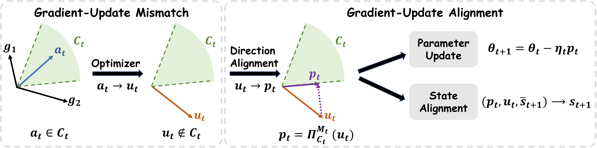
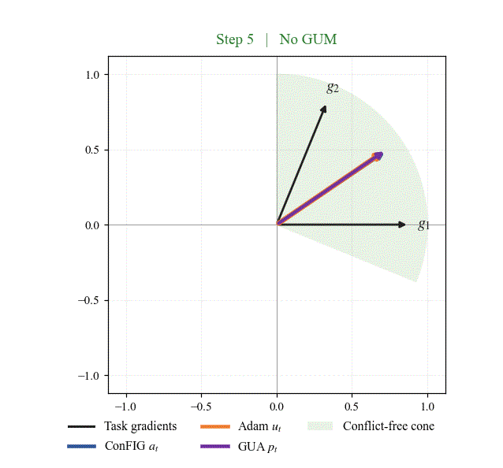
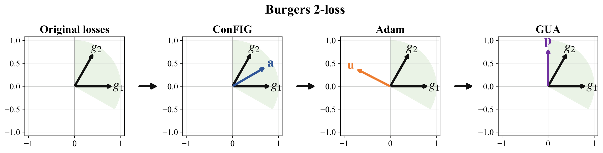
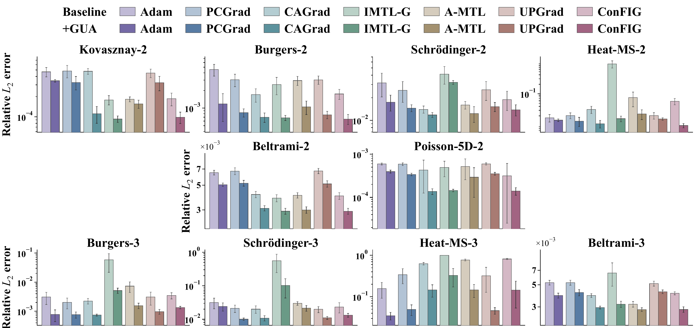

<div align="center">

# Gradient-Update Alignment

**Conflict handling on the update that is actually applied**

[About](#about) | [Paper Info](#paper-info) | [Installation](#installation) | [Quick Start](#quick-start)

</div>

## About

### What is Gradient-Update Mismatch?

Gradient-surgery methods construct a direction with a desired multi-objective
geometry before optimizer transformation. However, modern optimizers can alter
this direction through momentum, adaptive scaling, curvature information, or
other internal transformations.

Let $a_{t}$ denote the direction constructed before optimizer transformation, $u_{t}$ the optimizer proposal, and $\mathcal{C}_{t}$ the conflict-free cone induced by the
current loss-specific gradients. Even when

$$
a_t \in \mathcal{C}_t,
$$

the optimizer proposal may satisfy

$$
u_t \notin \mathcal{C}_t.
$$

We call this optimizer-induced discrepancy **Gradient-Update Mismatch (GUM)**.

### How does Gradient-Update Alignment work?

**Gradient-Update Alignment (GUA)** operates after optimizer transformation.
Given the optimizer proposal $u_{t}$, GUA projects it onto the current
conflict-free cone under a positive-definite projection metric $M_t\succ0$,
yielding the aligned update $p_t$,

$$
p_t = \Pi_{\mathcal{C}_t}^{M_t}(u_t).
$$

The aligned update $p_t$ is then applied to the model parameters.

For stateful optimizers, GUA can additionally align the optimizer state toward
a state reconstructed from the applied update.

<p align="center">
  
</p>

| Symbol | Role |
|:---:|---|
| $g_{i}$ | Loss-specific gradient |
| $a_{t}$ | Direction constructed by a gradient-surgery method before optimizer transformation |
| $u_{t}$ | Optimizer proposal after optimizer transformation |
| $p_{t}$ | Aligned update applied to the parameters |

### Visualization

Using the two-loss Burgers problem with ConFIG and Adam as a representative
example, we visualize how GUM arises during training and how GUA acts on the
resulting optimizer proposal. Importantly, GUM is not specific to the ConFIG–Adam combination. The same phenomenon can arise with other gradient surgery methods and optimizers.
The animation below follows a real training trajectory. The shaded region
denotes the current conflict-free cone. ConFIG constructs the pre-optimizer
direction $a_{t}$, which Adam transforms into the optimizer proposal $u_{t}$.
GUM occurs when a conflict-free $a_{t}$ is transformed into a proposal $u_{t}$
outside the cone. GUA then projects the proposal back into the cone to obtain
the aligned update $p_{t}$.

<p align="center">
  
</p>

The static slice below shows a representative step from the same
Burgers--ConFIG--Adam setting and makes the directional geometry easier to
inspect. All displayed vectors are normalized, so only their directions are
shown. The coordinate system is also rotated so that $g_{1}$ lies along
the positive horizontal axis.

<p align="center">
  
</p>

### Main Results

Across six PDE benchmarks and two- and three-loss decompositions, GUA eliminates
update-level conflicts in the evaluated PINN settings and consistently improves
performance across gradient-surgery methods. 
<p align="center">
  
</p>

## Paper Info

### Gradient-Update Mismatch: Rethinking Conflict-Free Training of Physics-Informed Neural Networks

**arXiv.** [Gradient-Update Mismatch: Rethinking Conflict-Free Training of
Physics-Informed Neural Networks](https://arxiv.org/abs/2609.01558).

**Abstract.**
Training Physics-Informed Neural Networks (PINNs) requires jointly optimizing
physics residual and initial/boundary condition loss terms, which often induce
conflicting gradients. Gradient surgery methods mitigate this issue by constructing directions from
loss-specific gradients to reduce conflict before optimizer transformation.
However, even when the constructed direction is conflict-free, this property
may not be preserved after optimizer transformation. Let $a_t$ denote the
direction constructed by gradient surgery, $u_t$ the optimizer proposal, and
$\mathcal C_t$ the conflict-free cone induced by the loss-specific gradients.
We show that modern optimizers can transform $a_t$ through mechanisms such as
historical state, adaptive scaling, preconditioning, or decoupled weight decay, so
$a_t\in\mathcal C_t$ does not generally imply $u_t\in\mathcal C_t$.
We refer to this optimizer-induced discrepancy in conflict-freeness between
$a_t$ and $u_t$ as **Gradient--Update Mismatch (GUM)**. Accordingly, we propose
**Gradient--Update Alignment (GUA)**, which projects $u_t$ onto $\mathcal C_t$ to
obtain the aligned update $p_t$ and applies $p_t$ to the parameters. When the
optimizer maintains internal state, GUA further adjusts this state toward targets
reconstructed from the applied update. We conduct extensive experiments and find
that GUM is widespread across momentum, adaptive, and curvature-based optimizers,
with conflict rates reaching up to 86.3\%. Across all PINN settings, GUA achieves
conflict-free applied updates and consistently improves various gradient surgery
methods, reducing the relative $L_2$ error by up to 98.2\% in individual settings.


### Citation

If you find this work useful, please cite:

```bibtex
@misc{xiao2026gradientupdatemismatchrethinkingconflictfree,
  title        = {Gradient-Update Mismatch: Rethinking Conflict-Free Training of Physics-Informed Neural Networks},
  author       = {Jing Xiao and Xinhai Chen and Qinglin Wang and Menghan Jia and Zhiquan Lai and Dongsheng Li and Jie Liu and Tiejun Li},
  year         = {2026},
  eprint       = {2609.01558},
  archivePrefix = {arXiv},
  primaryClass = {cs.LG},
  url          = {https://arxiv.org/abs/2609.01558},
}
```

## License

This project is licensed under the MIT License. See [LICENSE](LICENSE) for
details.

## Acknowledgements

This repository is based on and extends the official implementation of
[ConFIG](https://github.com/tum-pbs/ConFIG):

> Qiang Liu, Mengyu Chu, and Nils Thuerey. *ConFIG: Towards Conflict-free
> Training of Physics Informed Neural Networks.*

We thank the authors for publicly releasing the ConFIG implementation.

The original ConFIG implementation is licensed under the MIT License.

## Installation

### 1. Clone the repository

```bash
git clone <YOUR_REPOSITORY_URL>
cd <YOUR_REPOSITORY_NAME>
```

### 2. Create the environment

The reference environment uses Python 3.10.12, PyTorch 2.12.0,
torchvision 0.27.0, and CUDA 13.0. Each reported experiment was run on a
single NVIDIA GeForce RTX 4090 GPU.

We recommend creating a clean Conda environment:

```bash
conda create -n gua python=3.10.12
conda activate gua
```

Install the reference PyTorch build:

```bash
pip install torch==2.12.0 torchvision==0.27.0 \
  --index-url https://download.pytorch.org/whl/cu130
```

Then install the remaining dependencies:

```bash
pip install -r requirements.txt
```

## Repository Layout

```text
conflictfree/                 Core gradient, conflict, and projection operators
experiments/PINN/             PINN equations, trainers, and optimizer integration
experiments/MTL/              CelebA multi-task trainer and GUA adapter
docs/assets/                  Figures and README visualizations
```

## Quick Start

### 1. Prepare PINN data

The Burgers and Schrodinger reference files are included in

```text
experiments/PINN/data/
```

The remaining PINN evaluation sets are generated according to the
benchmark-specific equation protocols included in the repository.

### 2. Run PINN experiments

Users only need to select the equation, gradient-surgery method, loss
decomposition, and whether GUA is enabled. The optimizer and all remaining
optimization settings use the repository defaults.

The main options are:

```text
--equation <equation>
--method <method>
--n-losses <2|3>
--optimizer-correction <none|gua>
```

| Argument | Accepted values | Meaning |
|---|---|---|
| `--equation` | `burgers`, `schrodinger`, `heat`, `beltrami`, `kovasznay`, `poisson5d` | PINN equation to train |
| `--method` | `config`, `pcgrad`, `cagrad`, `upgrad`, `aligned_mtl`, `imtlg` | Gradient-surgery method |
| `--n-losses` | `2`, `3` | Loss decomposition. All equations support `2`, while `3` is available for Burgers, Schrodinger, Heat-MS, and Beltrami |
| `--optimizer-correction` | `none`, `gua` | Disable or enable Gradient-Update Alignment |

Baseline ConFIG:

```bash
python experiments/PINN/trainer.py \
  --equation burgers \
  --method config \
  --n-losses 2 \
  --optimizer-correction none
```

ConFIG with GUA:

```bash
python experiments/PINN/trainer.py \
  --equation burgers \
  --method config \
  --n-losses 2 \
  --optimizer-correction gua
```

Both commands above run one trial with the default paper seed, seed 0.

To reproduce the five-seed PINN evaluation reported in the paper, set
`--num-run 5`. For example, the following command runs ConFIG with GUA using
seeds 0--4:

```bash
python experiments/PINN/trainer.py \
  --equation burgers \
  --method config \
  --n-losses 2 \
  --optimizer-correction gua \
  --num-run 5
```

For the corresponding five-seed baseline, change
`--optimizer-correction gua` to `--optimizer-correction none`. To run one
specific seed, use `--random-seed <seed>`.

The available equations and methods can also be inspected with:

```bash
python experiments/PINN/trainer.py --help
```

### 3. Prepare CelebA

CelebA is not redistributed with this repository. Follow the data-preparation
instructions provided by the public FAMO or ConFIG implementations, then place
the prepared dataset in the following directory structure:

```text
experiments/MTL/celeba/dataset/
  Anno/list_attr_celeba.txt
  Eval/list_eval_partition.txt
  Img/img_align_celeba/
```

### 4. Run CelebA experiments

The CelebA entry point evaluates how ConFIG with and without GUA behaves as
task cardinality increases. The supported task counts are
`2`, `3`, `5`, `10`, `20`, `30`, and `40`.
The single-run examples below use the default paper seed, seed 0.

Baseline ConFIG:

```bash
python experiments/MTL/celeba/trainer.py \
  --method config \
  --num-tasks 10 \
  --optimizer-correction none
```

ConFIG with GUA:

```bash
python experiments/MTL/celeba/trainer.py \
  --method config \
  --num-tasks 10 \
  --optimizer-correction gua
```

The CelebA results reported in the paper use seeds 0--2. They can be run with

```text
--seeds 0,1,2 --num-run 3
```

Use `--data-path` when the prepared dataset is stored outside the repository,
and `--save-dir` to select the output directory.
